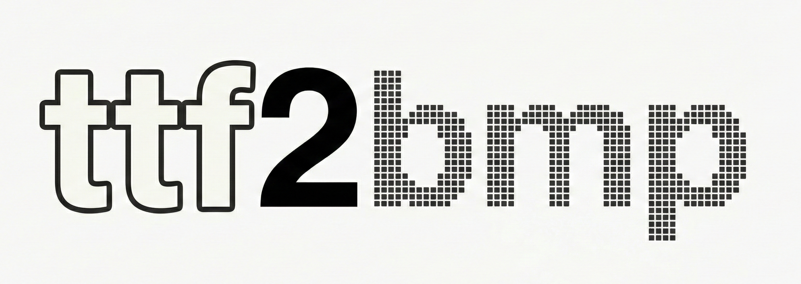

# ttf2bmp

TTF to Bitmap Font Converter.

[](https://github.com/wkusnierczyk/ttf2bmp/actions)
[](https://goreportcard.com/report/github.com/wkusnierczyk/ttf2bmp)
[](https://pkg.go.dev/github.com/wkusnierczyk/ttf2bmp)
[](https://opensource.org/licenses/MIT)



The `ttf2bmp` project provides a Go library and a command-line tool for converting TrueType fonts (`.ttf`) into Bitmap
fonts.
It generates a texture atlas (`.png`) and a descriptor file (`.fnt`), compatible
with [AngelCode BMFont](https://www.angelcode.com/products/bmfont/) and standard game engines (Unity, Godot, LibGDX, etc.).

## Contents

* [Features](#features)
* [Project structure](#project-structure)
* [Internals and algorithms](#internals-and-algorithms)
* [Dependencies](#dependencies)
* [Building, testing, and running](#building-testing-and-running)

## Features

|                              |                                                                                                                             |
|:-----------------------------|:----------------------------------------------------------------------------------------------------------------------------|
| **Pure Go**                  | No C bindings, uses `golang.org/x/image` and `freetype`                                                                     |
| **Customizable**             | Set font size, DPI, texture size, and custom character sets                                                                 |
| **Standard Output**          | Generates compliant text-based `.fnt` files                                                                                 |
| **Immediate Mode Rendering** | Rasterizes and commits pixels instantly to prevent memory corruption and pointer aliasing bugs common in deferred rendering |
| **Smart Packing**            | Uses a "Shelf Packing" algorithm with dynamic line wrapping to efficiently organize glyphs                                  |
| **AngelCode Export**         | Fully compatible with the BMFont standard used by Unity, Godot, LibGDX, and custom engines                                  |
| **High DPI Support**         | Configurable DPI and font size                                                                                              |

To be added in a future version:

* [**Kerning Support**](https://github.com/wkusnierczyk/ttf2bmp/issues/5)  
Extract kerning pairs from the TTF and exports them to the `.fnt` file.
* [**Multipage atlas**](https://github.com/wkusnierczyk/ttf2bmp/issues/4)  
Avoid erroring out when atlas capacity is exceeded.
* [**Signed distance field**](https://github.com/wkusnierczyk/ttf2bmp/issues/3)  
Instead of storing opacity (0-255), store the distance from the pixel to the nearest glyph edge.

## Project structure

```text
.
├── LICENSE             # MIT license
├── Makefile            # convenience Makefile
├── README.md           # this file
├── cmd   
│   └── ttf2bmp
│       └── main.go     # The CLI entry point
├── go.mod              # Go module manifest
├── go.sum              # Go module dependency checksums
├── ttf2bmp.go          # The library entry point
└── ttf2bmp_test.go     # Unit tests
```

## Internals and algorithms

**Immediate Mode Rasterization**  
Unlike tools that render all glyphs to temporary buffers and then copy them (which can lead to memory aliasing issues
with FreeType), `ttf2bmp` uses an Immediate Mode approach:

* Render: The glyph is rasterized using freetype.
* Pack: The algorithm calculates the next available position on the texture.
* Commit: Pixels are copied immediately to the final image atlas.
* Discard: The temporary buffer is discarded/reused safely.

**Shelf Packing**  
The atlas uses a Row-Based (Shelf) packing strategy:

* Glyphs are placed left-to-right.
* When the current X position + glyph width exceeds the sheet width, the cursor moves to the start of the next line.
* The Y increment is determined by the tallest glyph in the previous row.

[Future version] **Kerning Extraction**  
After packing, the library performs an $O(N^2)$ pass over the requested runes to query the font face for kerning
adjustments.
These are scaled from Font Units (FUnits) to pixels based on the DPI and Font Size.

## Dependencies

The project relies on standard Go image libraries and the FreeType engine:

* [`github.com/golang/freetype`](https://github.com/golang/freetype)
* [`golang.org/x/image`](https://pkg.go.dev/golang.org/x/image)

## Building, testing, and running

You can build the project using `go` directly, or using the provided `Makefile`.

| Action             | `go`           | `make`       |
|--------------------|----------------|--------------|
| Build the library  | `go build .`   |              |
| Build the CLI tool | `go build -o ttf2bmp cmd/ttf2bmp/main.go` | `make build` |
| Run unit tests     | `go test -v .` | `make test`  
Run benchmark|`go test -bench=. -benchmem .`| `make bench` |
| Run linter         | `golangci-lint run` | `make lint`  |
| Run formatter      | `gofmt .`      | `make check` |
| Clean up           |    | `make clean` |

Consult the `Makefile` for additional targets to:
* install dependencies (`make deps`);
* runn the CLI tool (`make run`).
* clean up (`make clean`);

The `Makefile` also provides targets for cross-compiling to Linux, MacOS  (both `amd64` and `arm64` architectures), and Windows:

```bash
make build-{linux,windows,mac}
```

For details on how to invoke the CLI tool, consult its help page:
```bash
./bin/ttf2bmp -h
```
