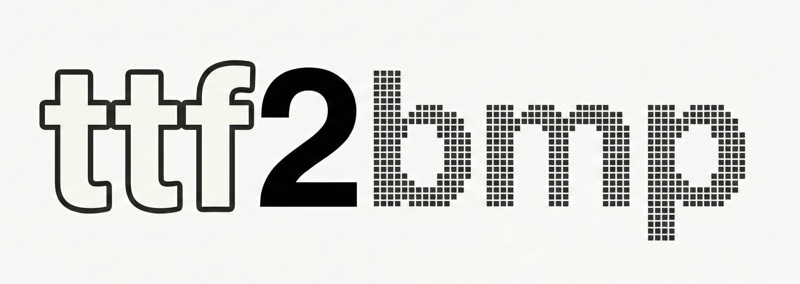
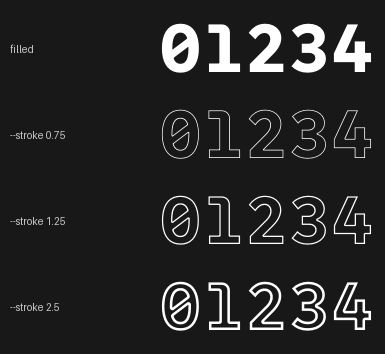
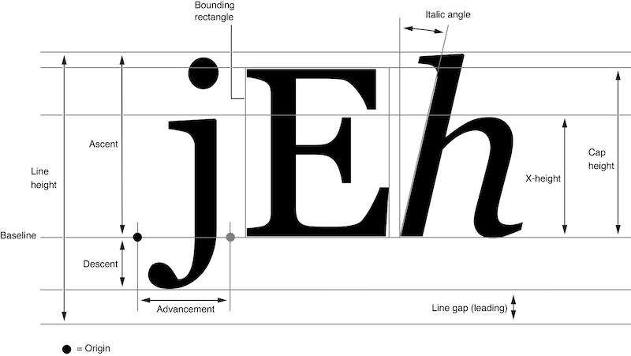
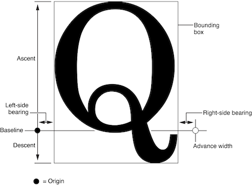

# ttf2bmp

[](https://github.com/wkusnierczyk/ttf2bmp/actions/workflows/quality.yml)
[](https://github.com/wkusnierczyk/ttf2bmp/actions/workflows/integration.yml)



**ttf2bmp** is a robust, efficient command-line tool written in Go that converts TrueType Fonts (TTF) into AngelCode
BMFont format (BMP image + FNT descriptor).
It is designed for high-volume batch processing, featuring a rolling progress dashboard, parallel-ready architecture,
and automated regression testing.

## Features

* **Batch Processing**: Accepts glob patterns (e.g., `fonts/*.ttf`) to process hundreds of fonts in one go.
* **Multi-Size Support**: Generate multiple font sizes (e.g., 12, 24, 32px) in a single run.
* **Smart Dashboard**: A rolling command-line UI providing real-time progress bars and log windows without cluttering
  the terminal.
* **Hollow Glyphs**: Optionally keeps only an outline of each glyph, with a fractional, antialiased stroke width.
* **Verification Suite**: Includes built-in tools for visual inspection and pixel-perfect regression testing against the
  original TTF.
* **Cross-Platform**: Compiles for Linux, Windows, and macOS (Intel/Apple Silicon) with zero dependencies.
* **Build system**: Uses `make` for automation and reproducible builds.

## Installation

The instructions below use `make` to build, test, and run the tool.
Consult the `Makefile` for specific of all the targets.
To see what commands `make` would execute without actually running them, use `make <target> -n>`.  
For example:

```bash
$ make build -n

echo "  >  Verifying Library compilation..."
go build ./converter/...
echo "  >  Building CLI (ttf2bmp)..."
mkdir -p bin
go build -o bin/ttf2bmp ./main.go
echo "  >  Building Verifier Tool..."
mkdir -p bin
go build -o bin/verifier ./tools/verifier/main.go
echo "  >  Building Validator Tool..."
mkdir -p bin
go build -o bin/validator ./tools/validator/main.go
```

### Prerequisites

*
* [Go 1.25](https://go.dev/dl/) or higher.

### Building from source

```bash
git clone [https://github.com/wkusnierczyk/ttf2bmp.git](https://github.com/wkusnierczyk/ttf2bmp.git)
cd ttf2bmp
make build
```

The binary will be placed in `bin/ttf2bmp`.

## Usage

Run the tool using the flags below. The font pattern must be quoted to prevent shell expansion if using wildcards.

```bash
./bin/ttf2bmp [options]
```

**Note**  
The tool does not use a separate input directory flag. 
Instead, use the `--fonts` flag to provide a file path or a glob pattern to select your inputs.

| Flag      | Short | Description                     | Required          | Example          |
|:----------|:------|:--------------------------------|:------------------|:-----------------|
| `--fonts` | `-f`  | Glob pattern for input fonts    | Yes               | `"assets/*.ttf"` |
| `--sizes` | `-s`  | Comma-separated list of sizes   | Yes               | `"16, 24, 32"`   |
| `--chars` | `-c`  | String of characters to include | Yes               | `"ABCabc123"`    |
| `--out`   | `-o`  | Output directory                | No (Default: `.`) | `build/fonts`    |
| `--stroke` | `-w` | Outline width in pixels; `0` draws filled glyphs | No (Default: `0`) | `1.25` |

### Example

```bash
./bin/ttf2bmp -f "assets/fonts/*.ttf" -s "12,24" -c "ABSabc" -o output/
```

### Hollow glyphs

`--stroke W` keeps only the band of each glyph that lies within `W` pixels of its edge, and clears the
interior, so the glyph is drawn as an outline:



* **The band lies inside the glyph.** Nothing else changes: the atlas layout, the glyph bounds and every metric in the
  `.fnt` are the same as for the filled font, so a hollow font can replace the filled one at the same size.
* **`W` can be fractional.** The outer edge is the rasteriser's own antialiasing, and the inner edge is antialiased
  too: the interior is measured on an 8x supersampled render and filtered back down. So a stroke can be scaled with
  the font size or the screen resolution without rounding to whole pixels.
* **Hollow fonts get their own file names**, with a suffix (a `.` in the width is written as `p`), so they can share
  a directory with the filled fonts: `Face-68.fnt`, `Face-68-stroke1.fnt`, `Face-68-stroke1p25.fnt`.
* **Without `--stroke`, output is unchanged**, byte for byte.

```bash
./bin/ttf2bmp -f "assets/fonts/Face.ttf" -s "54,68" -c "0123456789:" --stroke 1.25 -o output/
```

## Project structure

The project is organized into a modular structure separating the CLI, the core library, and the verification tools.

```text
/ttf2bmp
  ├── main.go                # Main CLI entry point (Batch Processor & UI)
  ├── main_test.go           # CLI option tests
  ├── converter/             # Core Library
  |   ├── bmp.go             # BMP image generation logic
  │   ├── lib.go             # Font rendering & FNT generation logic
  │   ├── lib_test.go        # Unit tests & Benchmarks
  │   ├── stroke.go          # Hollow glyphs (--stroke)
  │   └── stroke_test.go     # Stroke and distance transform tests
  ├── go.mod                 # Dependency Management
  ├── go.sum                 # Dependency Lockfile
  ├── tools/                 # Quality Assurance Tools
  │   ├── verifier/          # Visual Inspector (FNT -> PNG)
  │   │   └── main.go
  │   └── validator/         # Regression Tester (TTF vs FNT Diff)
  │       └── main.go
  ├── .github/workflows/     # CI Pipelines
  └── Makefile               # Build & Test Automation
```

## Development and testing

| Command      | Description                                                     |
|:-------------|:----------------------------------------------------------------|
| `make deps`  | Downloads dependencies and updates the lockfile.                
| `make all`   | Runs dependencies, static checks, tests, and builds the binary. |
| `make build` | Compiles the main CLI.                         |
| `make test`  | Fetches the test font if missing, then runs all unit tests.     |
| `make bench` | Runs performance benchmarks.                                    |
| `make check` | Runs `go vet` and `golangci-lint` (atatic analysis).            |
| `make fmt`   | Runs `go fmt` on all source files.                              |
| `make clean` | Removes build artifacts and output directories.                 |

### Verification tools

This project includes two specialized tools in the `tools/` directory to ensure rendering quality.

#### Visual verifier

The verifier reads a generated `.fnt` and `.bmp` pair and renders them onto a single PNG canvas for easy visual inspection.

```bash
make verify -- -fnt output/arial-16.fnt
# Output: output/arial-16_verify.png
```

**Note**  
You can build the tool binary with `make build-verifier`.

#### Regression validator

Mathematically compares the output of the **Generated FNT/BMP** against the **Original TTF** using Go's native FreeType
rendering. 
It calculates a "Difference Score" and fails if it exceeds a tolerance threshold.
Ideally, the score should be zero.

```bash
make validate -- -ttf arial.ttf -fnt output/arial-16.fnt -chars "ABC" -size 16
# Output: PASS / FAIL + debug_diff.png showing mismatches in red.
```

**Note**  
You can build the tool binary with `make build-validator`.

## Cross-compilation

To build binaries for all supported platforms at once:

```bash
make build-all
```

Artifacts created in `bin/`:

* `ttf2bmp-linux`
* `ttf2bmp-windows.exe`
* `ttf2bmp-darwin-amd64` (Intel Mac)
* `ttf2bmp-darwin-arm64` (Apple Silicon)

## CI/CD pipelines

We use GitHub Actions to enforce quality standards:

1. **Code Quality** (`quality.yml`):
    * Runs `golangci-lint`.
    * Runs unit tests (`go test -race`).
    * Runs benchmarks.

2. **Functional Verification** (`integration.yml`):
    * Builds the CLI.
    * Downloads a real open-source font (Go Regular).
    * Runs the `ttf2bmp` tool to generate assets.
    * Runs the **Validator** tool to ensure the output matches the original TTF mathematically.
    * Uploads debug images as artifacts if the test fails.

## License

[MIT](LICENSE)

## Contributing

Please feel welcome to open issues and submit pull requests.

## Reference

* [AngelCode BMFont Format](https://www.angelcode.com/products/bmfont/)
* [FreeType](https://www.freetype.org/)

### Font face terminology



